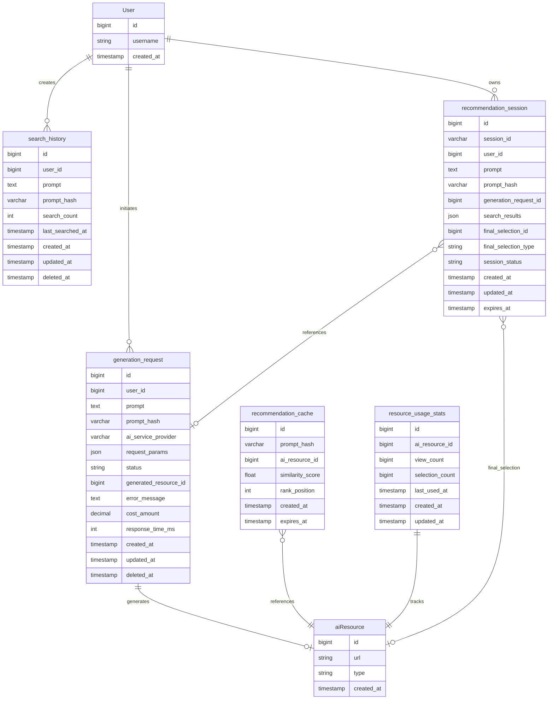

# 图片推荐功能数据库设计详解

## 1. 设计背景与思路

### 1.1 现有数据库结构分析

通过分析现有代码，发现当前系统已经有基础的资源管理架构：

```go
// 基础模型结构
type Model struct {
    ID        int64          `gorm:"column:id;autoIncrement;primaryKey"`
    CreatedAt time.Time      `gorm:"column:created_at;not null"`
    UpdatedAt time.Time      `gorm:"column:updated_at;not null"`
    DeletedAt gorm.DeletedAt `gorm:"column:deleted_at;index"`
}

// 现有Asset模型
type Asset struct {
    Model
    OwnerID     int64         `gorm:"column:owner_id;index"`
    DisplayName string        `gorm:"column:display_name;index:,class:FULLTEXT"`
    Type        AssetType     `gorm:"column:type;index"`
    Category    string        `gorm:"column:category;index"`
    Files       FileCollection `gorm:"column:files"`
    FilesHash   string        `gorm:"column:files_hash"`
    Visibility  Visibility    `gorm:"column:visibility;index"`
}
```

**发现的问题**：
- 现有Asset表主要用于存储Sprite、Backdrop、Sound等游戏资源
- 缺少专门针对AI生成图片资源的表结构
- 没有图片搜索历史、用户偏好、生成请求等数据的存储方案
- 缺少标签系统和推荐算法所需的数据支持

### 1.2 业务需求分析

基于架构设计，我们需要支持以下核心业务流程：

1. **用户发起生图+推荐请求**
   - 记录用户输入的prompt
   - 跟踪AI生图请求的状态和成本
   - 存储搜索历史用于个性化推荐

2. **并行处理流程**
   - AI生图：调用第三方服务，存储生成的图片
   - 图片搜索：基于CLIP模型计算相似度，缓存结果

3. **用户选择与反馈**
   - 记录用户最终选择的图片（新生成的还是历史的）
   - 统计图片使用频率，优化推荐算法

4. **系统运营与监控**
   - 分析热门prompt，控制生图成本
   - 统计用户偏好，提升推荐准确率

## 2. 数据表设计详解

### 2.1 搜索历史表 (search_history)

**设计目的**：记录用户的搜索行为，用于个性化推荐和热点分析

```sql
CREATE TABLE search_history (
    id BIGINT PRIMARY KEY AUTO_INCREMENT,
    user_id BIGINT,                              -- 用户ID，允许NULL支持匿名用户
    prompt TEXT NOT NULL,                        -- 用户输入的完整prompt
    prompt_hash VARCHAR(64) NOT NULL INDEX,     -- prompt的MD5哈希，用于去重和快速查找
    search_count INT DEFAULT 1,                 -- 相同prompt的搜索次数
    last_searched_at TIMESTAMP NOT NULL,        -- 最后一次搜索时间
    created_at TIMESTAMP NOT NULL DEFAULT CURRENT_TIMESTAMP,
    updated_at TIMESTAMP NOT NULL DEFAULT CURRENT_TIMESTAMP ON UPDATE CURRENT_TIMESTAMP,
    deleted_at TIMESTAMP NULL INDEX,
    
    INDEX idx_user_prompt (user_id, prompt_hash),  -- 用户维度的prompt查询
    INDEX idx_last_searched (last_searched_at),    -- 时间范围查询
    INDEX idx_prompt_hash (prompt_hash)            -- 热门prompt统计
);
```

**设计亮点**：
- **prompt_hash字段**：使用MD5哈希解决长文本索引问题，支持快速去重
- **search_count字段**：相同prompt累计搜索次数，用于热点分析
- **支持匿名用户**：user_id允许NULL，记录未登录用户行为
- **软删除支持**：继承系统的deleted_at机制

**业务场景**：
```go
// 查询用户最近的搜索历史
SELECT prompt, search_count, last_searched_at 
FROM search_history 
WHERE user_id = ? AND deleted_at IS NULL 
ORDER BY last_searched_at DESC LIMIT 10;

// 统计热门prompt
SELECT prompt, SUM(search_count) as total_searches
FROM search_history 
WHERE deleted_at IS NULL AND created_at >= DATE_SUB(NOW(), INTERVAL 7 DAY)
GROUP BY prompt_hash 
ORDER BY total_searches DESC LIMIT 20;
```

### 2.2 推荐结果缓存表 (recommendation_cache)

**设计目的**：缓存CLIP模型计算的相似度结果，避免重复计算

```sql
CREATE TABLE recommendation_cache (
    id BIGINT PRIMARY KEY AUTO_INCREMENT,
    prompt_hash VARCHAR(64) NOT NULL INDEX,     -- 关联search_history的prompt_hash
    ai_resource_id BIGINT NOT NULL,             -- 关联aiResource表的图片ID
    similarity_score FLOAT NOT NULL,            -- CLIP模型计算的相似度分数 [0,1]
    rank_position INT NOT NULL,                 -- 在推荐结果中的排名位置
    created_at TIMESTAMP NOT NULL DEFAULT CURRENT_TIMESTAMP,
    expires_at TIMESTAMP NOT NULL,              -- 缓存过期时间
    
    INDEX idx_prompt_rank (prompt_hash, rank_position),  -- 按prompt获取排序结果
    INDEX idx_expires (expires_at),                      -- 清理过期缓存
    FOREIGN KEY (ai_resource_id) REFERENCES aiResource(id) ON DELETE CASCADE
);
```

**设计亮点**：
- **expires_at字段**：显式过期时间，支持不同prompt的差异化缓存策略
- **rank_position字段**：预存储排序位置，避免实时排序开销
- **similarity_score字段**：保存原始相似度分数，支持二次排序和阈值过滤

**缓存策略**：
```go
// 查询缓存中的推荐结果
SELECT ar.id, ar.url, rc.similarity_score, rc.rank_position
FROM recommendation_cache rc
JOIN aiResource ar ON rc.ai_resource_id = ar.id
WHERE rc.prompt_hash = ? AND rc.expires_at > NOW()
ORDER BY rc.rank_position ASC LIMIT ?;

// 清理过期缓存（定时任务）
DELETE FROM recommendation_cache WHERE expires_at < NOW();
```

### 2.3 资源使用统计表 (resource_usage_stats)

**设计目的**：统计每张图片的使用情况，用于优化推荐算法和热度排序

```sql
CREATE TABLE resource_usage_stats (
    id BIGINT PRIMARY KEY AUTO_INCREMENT,
    ai_resource_id BIGINT NOT NULL,             -- 图片资源ID
    view_count BIGINT DEFAULT 0,                -- 展示次数（出现在推荐结果中）
    selection_count BIGINT DEFAULT 0,           -- 被用户选择的次数
    last_used_at TIMESTAMP,                     -- 最后一次使用时间
    created_at TIMESTAMP NOT NULL DEFAULT CURRENT_TIMESTAMP,
    updated_at TIMESTAMP NOT NULL DEFAULT CURRENT_TIMESTAMP ON UPDATE CURRENT_TIMESTAMP,
    
    UNIQUE KEY uk_resource (ai_resource_id),     -- 每个资源只有一条统计记录
    FOREIGN KEY (ai_resource_id) REFERENCES aiResource(id) ON DELETE CASCADE
);
```

**设计亮点**：
- **UNIQUE约束**：确保每个资源只有一条统计记录，避免数据重复
- **原子更新**：view_count和selection_count支持高并发的原子递增操作
- **热度计算**：selection_count/view_count = 选择率，作为图片质量指标

**统计查询**：
```go
// 更新展示统计
UPDATE resource_usage_stats 
SET view_count = view_count + 1, last_used_at = NOW() 
WHERE ai_resource_id = ?;

// 更新选择统计
UPDATE resource_usage_stats 
SET selection_count = selection_count + 1, last_used_at = NOW() 
WHERE ai_resource_id = ?;

// 查询热门图片
SELECT ar.*, rus.selection_count, rus.view_count,
       (rus.selection_count / GREATEST(rus.view_count, 1)) as selection_rate
FROM resource_usage_stats rus
JOIN aiResource ar ON rus.ai_resource_id = ar.id
WHERE rus.view_count >= 10  -- 有一定展示基数的图片
ORDER BY selection_rate DESC, rus.selection_count DESC LIMIT 50;
```

### 2.4 生图请求记录表 (generation_request)

**设计目的**：追踪每次AI生图请求的完整生命周期，用于成本控制和性能分析

```sql
CREATE TABLE generation_request (
    id BIGINT PRIMARY KEY AUTO_INCREMENT,
    user_id BIGINT,                             -- 发起请求的用户ID
    prompt TEXT NOT NULL,                       -- 生图使用的prompt
    prompt_hash VARCHAR(64) NOT NULL INDEX,    -- prompt哈希，关联search_history
    ai_service_provider VARCHAR(50) NOT NULL,  -- AI服务提供商：openai, midjourney, stability等
    request_params JSON,                        -- 生图参数：风格、尺寸、质量等
    status ENUM('pending', 'processing', 'completed', 'failed') DEFAULT 'pending',
    generated_resource_id BIGINT NULL,         -- 生成成功后关联的aiResource ID
    error_message TEXT NULL,                   -- 失败时的详细错误信息
    cost_amount DECIMAL(10,4) DEFAULT 0,      -- 本次生图的成本（美元）
    response_time_ms INT NULL,                 -- 生图耗时（毫秒）
    created_at TIMESTAMP NOT NULL DEFAULT CURRENT_TIMESTAMP,
    updated_at TIMESTAMP NOT NULL DEFAULT CURRENT_TIMESTAMP ON UPDATE CURRENT_TIMESTAMP,
    deleted_at TIMESTAMP NULL INDEX,
    
    INDEX idx_user_status (user_id, status),          -- 用户维度的请求状态查询
    INDEX idx_prompt_hash (prompt_hash),              -- 关联搜索历史
    INDEX idx_created_at (created_at),                -- 时间范围查询
    INDEX idx_provider_status (ai_service_provider, status),  -- 服务商性能分析
    FOREIGN KEY (generated_resource_id) REFERENCES aiResource(id) ON DELETE SET NULL
);
```

**设计亮点**：
- **状态机设计**：pending → processing → completed/failed，支持异步处理
- **JSON参数存储**：request_params字段存储复杂的生图参数，保持灵活性
- **成本追踪**：cost_amount使用DECIMAL类型，精确记录费用
- **性能监控**：response_time_ms字段用于分析不同服务商的响应速度

**状态流转示例**：
```go
// 创建生图请求
INSERT INTO generation_request (user_id, prompt, prompt_hash, ai_service_provider, request_params, status)
VALUES (?, ?, ?, 'openai', '{"style": "cartoon", "size": "512x512"}', 'pending');

// 更新为处理中状态
UPDATE generation_request SET status = 'processing', updated_at = NOW() WHERE id = ?;

// 完成生图，关联生成的资源
UPDATE generation_request 
SET status = 'completed', generated_resource_id = ?, cost_amount = ?, response_time_ms = ?, updated_at = NOW() 
WHERE id = ?;

// 成本分析查询
SELECT ai_service_provider, 
       COUNT(*) as total_requests,
       SUM(cost_amount) as total_cost,
       AVG(cost_amount) as avg_cost,
       AVG(response_time_ms) as avg_response_time,
       SUM(CASE WHEN status = 'completed' THEN 1 ELSE 0 END) / COUNT(*) as success_rate
FROM generation_request 
WHERE created_at >= DATE_SUB(NOW(), INTERVAL 30 DAY)
GROUP BY ai_service_provider;
```

### 2.5 智能推荐会话表 (recommendation_session)

**设计目的**：追踪用户的完整推荐会话，从请求到最终选择的全流程

```sql
CREATE TABLE recommendation_session (
    id BIGINT PRIMARY KEY AUTO_INCREMENT,
    session_id VARCHAR(64) NOT NULL UNIQUE,    -- 前端展示的会话ID，如 "sess_abc123"
    user_id BIGINT,                            -- 用户ID
    prompt TEXT NOT NULL,                      -- 用户输入的prompt
    prompt_hash VARCHAR(64) NOT NULL INDEX,   -- prompt哈希
    generation_request_id BIGINT NULL,        -- 关联的生图请求
    search_results JSON,                       -- 搜索到的相似图片结果（冗余存储）
    final_selection_id BIGINT NULL,           -- 用户最终选择的图片ID
    final_selection_type ENUM('generated', 'historical') NULL, -- 选择的图片类型
    session_status ENUM('active', 'completed', 'expired') DEFAULT 'active',
    created_at TIMESTAMP NOT NULL DEFAULT CURRENT_TIMESTAMP,
    updated_at TIMESTAMP NOT NULL DEFAULT CURRENT_TIMESTAMP ON UPDATE CURRENT_TIMESTAMP,
    expires_at TIMESTAMP NOT NULL,            -- 会话过期时间（通常24小时）
    
    INDEX idx_session_id (session_id),                    -- 前端会话查询
    INDEX idx_user_session (user_id, session_status),     -- 用户会话管理
    INDEX idx_prompt_hash (prompt_hash),                  -- prompt分析
    INDEX idx_expires (expires_at),                       -- 清理过期会话
    FOREIGN KEY (generation_request_id) REFERENCES generation_request(id) ON DELETE SET NULL,
    FOREIGN KEY (final_selection_id) REFERENCES aiResource(id) ON DELETE SET NULL
);
```

**设计亮点**：
- **session_id字段**：独立的会话ID，前端友好且不暴露内部ID结构
- **search_results字段**：JSON格式存储搜索结果快照，用于会话恢复和A/B测试分析
- **final_selection_type字段**：明确区分用户选择的是新生成图片还是历史图片
- **expires_at字段**：会话有效期管理，避免数据无限累积

**会话管理示例**：
```go
// 创建新会话
session_id := "sess_" + generateRandomString(8)
INSERT INTO recommendation_session (session_id, user_id, prompt, prompt_hash, expires_at)
VALUES (?, ?, ?, ?, DATE_ADD(NOW(), INTERVAL 24 HOUR));

// 更新会话结果
UPDATE recommendation_session 
SET generation_request_id = ?, search_results = ?, updated_at = NOW()
WHERE session_id = ?;

// 记录用户选择
UPDATE recommendation_session 
SET final_selection_id = ?, final_selection_type = 'historical', session_status = 'completed', updated_at = NOW()
WHERE session_id = ?;

// 用户偏好分析
SELECT final_selection_type, COUNT(*) as count,
       COUNT(*) * 100.0 / SUM(COUNT(*)) OVER() as percentage
FROM recommendation_session 
WHERE user_id = ? AND session_status = 'completed' AND final_selection_id IS NOT NULL
GROUP BY final_selection_type;
```

## 3. 表关系与数据流

### 3.1 表关系图




### 3.2 数据流分析

**1. 用户发起请求**
```
用户输入prompt → search_history (记录搜索)
                ↓
                prompt_hash (MD5计算)
```

**2. 并行处理阶段**
```
A. AI生图流程：
   generation_request (创建请求) → AI服务调用 → aiResource (存储图片) → generation_request (更新状态)

B. 搜索流程：
   prompt_hash → recommendation_cache (检查缓存) → spx-algorithm服务 → recommendation_cache (存储结果)
```

**3. 结果合并与会话管理**
```
recommendation_session (创建会话) → 合并结果 → 返回前端
                                    ↓
                             resource_usage_stats (更新展示统计)
```

**4. 用户选择反馈**
```
用户选择图片 → recommendation_session (记录选择) → resource_usage_stats (更新选择统计)
```

## 4. 索引策略与性能优化

### 4.1 关键索引设计

**高频查询索引**：
```sql
-- 用户历史查询（个性化推荐）
CREATE INDEX idx_search_user_time ON search_history(user_id, last_searched_at DESC);

-- 热门prompt统计（运营分析）
CREATE INDEX idx_search_hash_count ON search_history(prompt_hash, search_count DESC);

-- 缓存命中查询（性能关键）
CREATE INDEX idx_cache_prompt_rank ON recommendation_cache(prompt_hash, rank_position ASC);

-- 会话状态管理
CREATE INDEX idx_session_user_status ON recommendation_session(user_id, session_status, created_at DESC);

-- 成本分析查询
CREATE INDEX idx_generation_provider_time ON generation_request(ai_service_provider, created_at DESC);
```

**复合索引优化原则**：
- 等值条件字段在前，范围查询字段在后
- ORDER BY字段要在索引的最后
- 考虑查询的选择性，高选择性字段优先

### 4.2 分区策略

对于数据量大的表，建议按时间分区：

```sql
-- search_history按月分区
ALTER TABLE search_history PARTITION BY RANGE (YEAR(created_at) * 100 + MONTH(created_at)) (
    PARTITION p202401 VALUES LESS THAN (202402),
    PARTITION p202402 VALUES LESS THAN (202403),
    -- ...
    PARTITION pmax VALUES LESS THAN MAXVALUE
);

-- recommendation_cache按日分区（短期缓存）
ALTER TABLE recommendation_cache PARTITION BY RANGE (TO_DAYS(created_at)) (
    PARTITION p20240101 VALUES LESS THAN (TO_DAYS('2024-01-02')),
    -- ...
    PARTITION pmax VALUES LESS THAN MAXVALUE
);
```

### 4.3 数据清理策略

**定期清理任务**：
```sql
-- 清理过期缓存（每小时执行）
DELETE FROM recommendation_cache WHERE expires_at < NOW();

-- 清理过期会话（每天执行）
UPDATE recommendation_session SET session_status = 'expired' WHERE expires_at < NOW() AND session_status = 'active';

-- 归档历史数据（每月执行）
-- 将6个月前的search_history移动到历史表
INSERT INTO search_history_archive SELECT * FROM search_history WHERE created_at < DATE_SUB(NOW(), INTERVAL 6 MONTH);
DELETE FROM search_history WHERE created_at < DATE_SUB(NOW(), INTERVAL 6 MONTH);
```

## 5. 数据一致性与事务处理

### 5.1 关键业务事务

**1. 创建推荐会话事务**
```go
tx := db.Begin()
defer func() {
    if r := recover(); r != nil {
        tx.Rollback()
    }
}()

// 1. 记录搜索历史
searchHistory := &SearchHistory{...}
if err := tx.Create(searchHistory).Error; err != nil {
    tx.Rollback()
    return err
}

// 2. 创建生图请求
genRequest := &GenerationRequest{...}
if err := tx.Create(genRequest).Error; err != nil {
    tx.Rollback()
    return err
}

// 3. 创建推荐会话
session := &RecommendationSession{...}
if err := tx.Create(session).Error; err != nil {
    tx.Rollback()
    return err
}

tx.Commit()
```

**2. 用户选择反馈事务**
```go
tx := db.Begin()
defer func() {
    if r := recover(); r != nil {
        tx.Rollback()
    }
}()

// 1. 更新会话状态
if err := tx.Model(&session).Updates(map[string]interface{}{
    "final_selection_id": selectedImageID,
    "final_selection_type": selectionType,
    "session_status": "completed",
}).Error; err != nil {
    tx.Rollback()
    return err
}

// 2. 更新资源使用统计（使用ON DUPLICATE KEY UPDATE）
if err := tx.Exec(`
    INSERT INTO resource_usage_stats (ai_resource_id, selection_count, last_used_at) 
    VALUES (?, 1, NOW()) 
    ON DUPLICATE KEY UPDATE 
        selection_count = selection_count + 1, 
        last_used_at = NOW()
`, selectedImageID).Error; err != nil {
    tx.Rollback()
    return err
}

tx.Commit()
```

### 5.2 数据一致性保障

**1. 外键约束**
- 使用FOREIGN KEY确保引用完整性
- 配置适当的ON DELETE策略（CASCADE、SET NULL）

**2. 唯一性约束**
- session_id唯一性
- resource_usage_stats的ai_resource_id唯一性

**3. 状态机约束**
- generation_request.status只能按 pending→processing→completed/failed 流转
- recommendation_session.session_status的合法状态转换

## 6. 监控与运维

### 6.1 关键监控指标

**数据库层面**：
```sql
-- 表大小监控
SELECT table_name, 
       ROUND(((data_length + index_length) / 1024 / 1024), 2) AS 'Size(MB)'
FROM information_schema.tables 
WHERE table_schema = 'spx_database' AND table_name IN (
    'search_history', 'generation_request', 'recommendation_session', 
    'recommendation_cache', 'resource_usage_stats'
);

-- 索引使用率监控
SELECT object_name, index_name, rows_examined, rows_sent
FROM performance_schema.table_io_waits_summary_by_index_usage
WHERE object_schema = 'spx_database';

-- 慢查询监控
SELECT query_time, lock_time, rows_sent, rows_examined, db, sql_text
FROM mysql.slow_log
WHERE start_time > DATE_SUB(NOW(), INTERVAL 1 HOUR);
```

**业务层面**：
```sql
-- 生图成功率监控
SELECT ai_service_provider,
       COUNT(*) as total,
       SUM(CASE WHEN status = 'completed' THEN 1 ELSE 0 END) as success,
       ROUND(SUM(CASE WHEN status = 'completed' THEN 1 ELSE 0 END) * 100.0 / COUNT(*), 2) as success_rate
FROM generation_request
WHERE created_at > DATE_SUB(NOW(), INTERVAL 24 HOUR)
GROUP BY ai_service_provider;

-- 用户选择偏好分析
SELECT final_selection_type, COUNT(*) as count
FROM recommendation_session
WHERE session_status = 'completed' AND final_selection_id IS NOT NULL
AND created_at > DATE_SUB(NOW(), INTERVAL 7 DAY)
GROUP BY final_selection_type;

-- 缓存命中率统计
SELECT 'cache_hit' as type, COUNT(*) as count FROM recommendation_cache WHERE created_at > DATE_SUB(NOW(), INTERVAL 1 HOUR)
UNION ALL
SELECT 'cache_miss' as type, COUNT(*) as count FROM search_history WHERE created_at > DATE_SUB(NOW(), INTERVAL 1 HOUR);
```

### 6.2 数据备份策略

**分层备份**：
1. **实时备份**：MySQL主从复制 + Binlog
2. **定期全量备份**：每天凌晨全库备份
3. **增量备份**：每小时增量备份关键表
4. **长期存储**：月度备份归档到对象存储

**备份脚本示例**：
```bash
#!/bin/bash
# 关键表增量备份
mysqldump --single-transaction --routines --triggers \
  --where="created_at >= DATE_SUB(NOW(), INTERVAL 1 HOUR)" \
  spx_database search_history generation_request recommendation_session \
  > backup_$(date +%Y%m%d_%H%M%S).sql
```

## 7. 总结

这五张表的设计遵循以下核心原则：

1. **业务导向**：每张表都对应明确的业务场景和数据流
2. **性能优先**：合理的索引设计和分区策略
3. **扩展性**：JSON字段存储灵活参数，状态机支持业务演进
4. **数据完整性**：外键约束、唯一约束、软删除机制
5. **运维友好**：清晰的命名规范、完善的监控指标

通过这样的设计，可以支撑高并发的AI图片生成与推荐业务，同时为后续的算法优化和业务分析提供完整的数据基础。