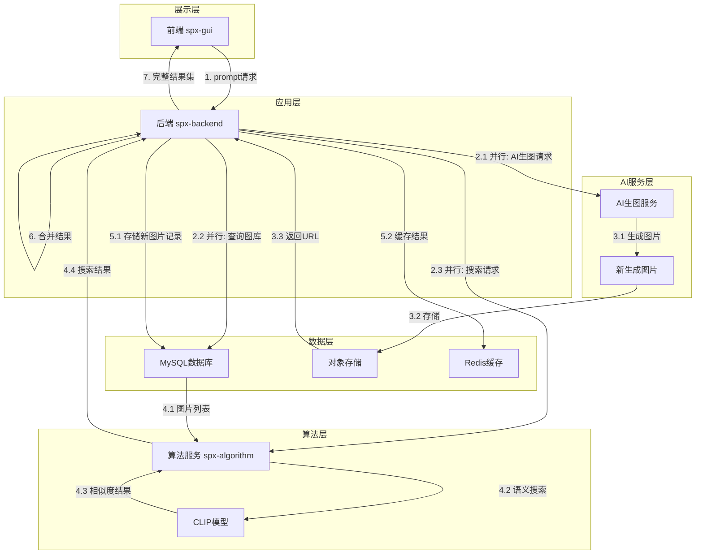
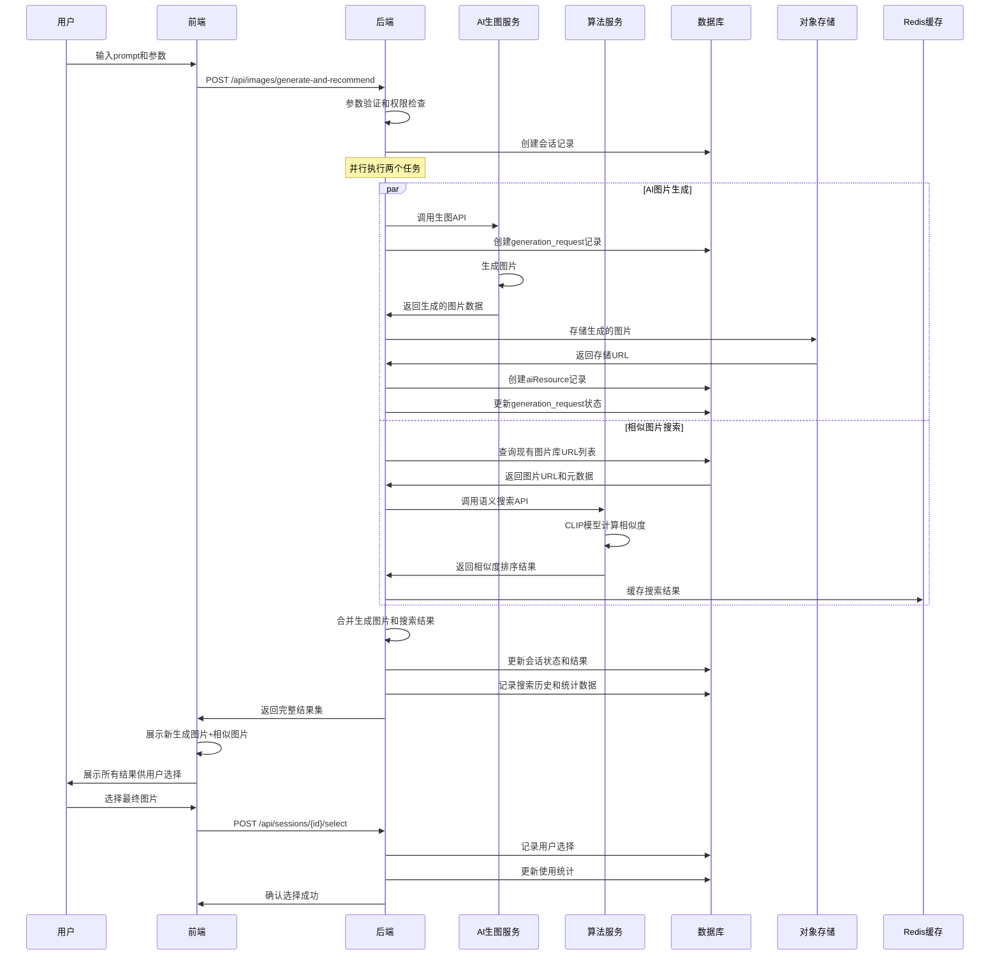
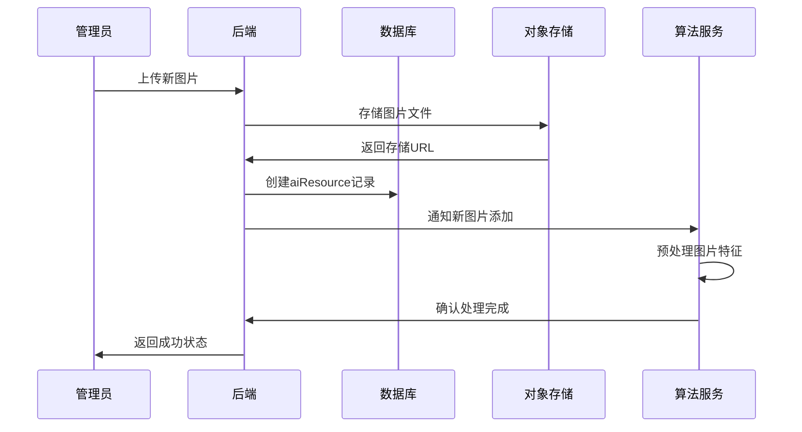

# 基于Prompt的图片推荐功能架构设计

## 1. 项目概述

### 1.1 功能描述
设计一个智能图片生成与推荐系统，结合AI图片生成和历史图库搜索。当用户输入prompt时，系统并行执行两个任务：
1. **AI图片生成**: 调用AI生图服务创建全新图片，并存储到图库中
2. **相似图片搜索**: 从现有图库中搜索与prompt最相似的历史图片

最终返回包含新生成图片和相似历史图片的完整结果集，为用户提供丰富的选择。

### 1.2 核心目标
- **用户体验**: 为用户提供AI新生成图片 + 历史相似图片的完整解决方案
- **性能优化**: 并行执行AI生图和相似图片搜索，提升整体响应速度
- **资源积累**: 将每次AI生成的图片存储到图库，持续扩充资源池
- **智能推荐**: 基于历史数据和用户行为优化推荐算法
- **可扩展性**: 支持多种AI生图服务和搜索算法的集成

## 2. 系统架构设计

### 2.1 整体架构图



### 2.2 组件说明

#### 2.2.1 前端层 (spx-gui)
- **职责**: 用户交互界面，提供prompt输入和结果展示
- **技术栈**: Vue 3, TypeScript
- **主要功能**:
  - Prompt输入组件
  - 图片推荐结果展示
  - 分页和筛选功能
  - 图片预览和选择

#### 2.2.2 后端层 (spx-backend)
- **职责**: 业务逻辑处理，协调各个服务
- **技术栈**: Go, YAP框架, GORM
- **主要功能**:
  - 接口路由和参数验证
  - 权限认证和授权
  - 缓存管理和数据聚合
  - 日志记录和错误处理

#### 2.2.3 算法服务层 (spx-algorithm)
- **职责**: 图片语义搜索和相似度计算
- **技术栈**: Python, Flask, OpenCLIP, PyTorch
- **主要功能**:
  - 文本编码和图片特征提取
  - 相似度计算和排序
  - 支持批量处理

#### 2.2.4 AI生图服务层
- **职责**: 根据prompt生成新图片
- **技术栈**: OpenAI DALL-E、Midjourney、Stable Diffusion等
- **主要功能**:
  - 基于文本prompt生成图片
  - 支持多种图片风格和尺寸
  - API调用和结果处理

#### 2.2.5 数据存储层
- **MySQL**: 结构化数据存储
- **对象存储**: 图片文件存储
- **Redis**: 缓存和会话管理

## 3. 数据库设计扩展

### 3.1 现有表结构回顾
基于现有的数据库设计，我们已经有：
- `aiResource`: AI资源表
- `label`: 标签表  
- `resource_label`: 资源标签关联表

### 3.2 推荐功能扩展

#### 3.2.1 搜索历史表 (search_history)
```sql
CREATE TABLE search_history (
    id BIGINT PRIMARY KEY AUTO_INCREMENT,
    user_id BIGINT,
    prompt TEXT NOT NULL,
    prompt_hash VARCHAR(64) NOT NULL INDEX, -- 用于去重和快速查找
    search_count INT DEFAULT 1,
    last_searched_at TIMESTAMP NOT NULL,
    created_at TIMESTAMP NOT NULL DEFAULT CURRENT_TIMESTAMP,
    updated_at TIMESTAMP NOT NULL DEFAULT CURRENT_TIMESTAMP ON UPDATE CURRENT_TIMESTAMP,
    deleted_at TIMESTAMP NULL INDEX,
    
    INDEX idx_user_prompt (user_id, prompt_hash),
    INDEX idx_last_searched (last_searched_at)
);
```

#### 3.2.2 推荐结果缓存表 (recommendation_cache)
```sql
CREATE TABLE recommendation_cache (
    id BIGINT PRIMARY KEY AUTO_INCREMENT,
    prompt_hash VARCHAR(64) NOT NULL INDEX,
    ai_resource_id BIGINT NOT NULL,
    similarity_score FLOAT NOT NULL,
    rank_position INT NOT NULL,
    created_at TIMESTAMP NOT NULL DEFAULT CURRENT_TIMESTAMP,
    expires_at TIMESTAMP NOT NULL,
    
    INDEX idx_prompt_rank (prompt_hash, rank_position),
    FOREIGN KEY (ai_resource_id) REFERENCES aiResource(id)
);
```

#### 3.2.3 资源使用统计表 (resource_usage_stats)
```sql
CREATE TABLE resource_usage_stats (
    id BIGINT PRIMARY KEY AUTO_INCREMENT,
    ai_resource_id BIGINT NOT NULL,
    view_count BIGINT DEFAULT 0,
    selection_count BIGINT DEFAULT 0,
    last_used_at TIMESTAMP,
    created_at TIMESTAMP NOT NULL DEFAULT CURRENT_TIMESTAMP,
    updated_at TIMESTAMP NOT NULL DEFAULT CURRENT_TIMESTAMP ON UPDATE CURRENT_TIMESTAMP,
    
    UNIQUE KEY uk_resource (ai_resource_id),
    FOREIGN KEY (ai_resource_id) REFERENCES aiResource(id)
);
```

#### 3.2.4 生图请求记录表 (generation_request)
```sql
CREATE TABLE generation_request (
    id BIGINT PRIMARY KEY AUTO_INCREMENT,
    user_id BIGINT,
    prompt TEXT NOT NULL,
    prompt_hash VARCHAR(64) NOT NULL INDEX,
    ai_service_provider VARCHAR(50) NOT NULL, -- openai, midjourney, stable-diffusion等
    request_params JSON, -- 生图参数：风格、尺寸、质量等
    status ENUM('pending', 'processing', 'completed', 'failed') DEFAULT 'pending',
    generated_resource_id BIGINT NULL, -- 生成成功后关联到aiResource表
    error_message TEXT NULL, -- 失败时的错误信息
    cost_amount DECIMAL(10,4) DEFAULT 0, -- 生图成本
    response_time_ms INT NULL, -- 生图耗时
    created_at TIMESTAMP NOT NULL DEFAULT CURRENT_TIMESTAMP,
    updated_at TIMESTAMP NOT NULL DEFAULT CURRENT_TIMESTAMP ON UPDATE CURRENT_TIMESTAMP,
    deleted_at TIMESTAMP NULL INDEX,
    
    INDEX idx_user_status (user_id, status),
    INDEX idx_prompt_hash (prompt_hash),
    INDEX idx_created_at (created_at),
    FOREIGN KEY (generated_resource_id) REFERENCES aiResource(id)
);
```

#### 3.2.5 智能推荐会话表 (recommendation_session)
```sql
CREATE TABLE recommendation_session (
    id BIGINT PRIMARY KEY AUTO_INCREMENT,
    user_id BIGINT,
    prompt TEXT NOT NULL,
    prompt_hash VARCHAR(64) NOT NULL INDEX,
    generation_request_id BIGINT NULL, -- 关联的生图请求
    search_results JSON, -- 搜索到的相似图片结果
    final_selection_id BIGINT NULL, -- 用户最终选择的图片
    session_status ENUM('active', 'completed', 'expired') DEFAULT 'active',
    created_at TIMESTAMP NOT NULL DEFAULT CURRENT_TIMESTAMP,
    updated_at TIMESTAMP NOT NULL DEFAULT CURRENT_TIMESTAMP ON UPDATE CURRENT_TIMESTAMP,
    expires_at TIMESTAMP NOT NULL, -- 会话过期时间
    
    INDEX idx_user_session (user_id, session_status),
    INDEX idx_prompt_hash (prompt_hash),
    FOREIGN KEY (generation_request_id) REFERENCES generation_request(id),
    FOREIGN KEY (final_selection_id) REFERENCES aiResource(id)
);
```

## 4. API接口设计

### 4.1 智能图片推荐接口

#### POST /api/images/generate-and-recommend
```json
{
  "request": {
    "prompt": "a cute cat playing with a ball",
    "generation_params": {
      "style": "cartoon", 
      "size": "512x512",
      "quality": "standard",
      "ai_provider": "openai"
    },
    "search_params": {
      "top_k": 8,
      "category_filters": ["animal", "cute"],
      "min_similarity": 0.6
    },
    "options": {
      "enable_generation": true,
      "enable_search": true,
      "use_cache": true
    }
  },
  "response": {
    "success": true,
    "data": {
      "session_id": "sess_abc123",
      "prompt": "a cute cat playing with a ball",
      "processing_time_ms": 2500,
      "results": {
        "generated_image": {
          "id": 1001,
          "url": "https://storage.example.com/images/generated-1001.png",
          "type": "generated",
          "ai_provider": "openai",
          "generation_time_ms": 2200,
          "cost": 0.02,
          "created_at": "2024-01-01T12:00:00Z"
        },
        "similar_images": [
          {
            "id": 123,
            "url": "https://storage.example.com/images/cat-123.svg",
            "type": "historical",
            "similarity_score": 0.89,
            "rank": 1,
            "labels": ["cat", "cute", "animal"],
            "usage_stats": {
              "view_count": 45,
              "selection_count": 12
            },
            "created_at": "2024-01-01T10:00:00Z"
          },
          {
            "id": 456,
            "url": "https://storage.example.com/images/cat-456.svg",
            "type": "historical", 
            "similarity_score": 0.83,
            "rank": 2,
            "labels": ["cat", "play", "ball"],
            "usage_stats": {
              "view_count": 23,
              "selection_count": 5
            },
            "created_at": "2024-01-01T09:00:00Z"
          }
        ]
      },
      "statistics": {
        "total_similar_found": 15,
        "returned_similar_count": 2,
        "search_time_ms": 300,
        "cached_results": false
      }
    }
  }
}
```

#### GET /api/sessions/{session_id}
```json
{
  "response": {
    "success": true,
    "data": {
      "session_id": "sess_abc123",
      "status": "completed",
      "prompt": "a cute cat playing with a ball",
      "generation_status": "completed",
      "search_status": "completed",
      "created_at": "2024-01-01T12:00:00Z",
      "updated_at": "2024-01-01T12:00:05Z",
      "results": {
        "generated_image": {...},
        "similar_images": [...]
      }
    }
  }
}
```

#### POST /api/sessions/{session_id}/select
```json
{
  "request": {
    "selected_image_id": 123,
    "selection_reason": "best_match"
  },
  "response": {
    "success": true,
    "message": "Selection recorded successfully"
  }
}
```

### 4.2 历史记录接口

#### GET /api/users/generation-history
```json
{
  "response": {
    "success": true,
    "data": {
      "generations": [
        {
          "session_id": "sess_abc123",
          "prompt": "a cute cat playing",
          "generated_at": "2024-01-01T12:00:00Z",
          "ai_provider": "openai",
          "cost": 0.02,
          "selected_image_id": 123
        }
      ],
      "pagination": {
        "page": 1,
        "limit": 20,
        "total": 100
      }
    }
  }
}
```

### 4.3 管理接口

#### POST /api/admin/resources/sync
同步图库到算法服务的接口

#### GET /api/admin/generation/stats
```json
{
  "response": {
    "success": true,
    "data": {
      "total_generations": 1250,
      "today_generations": 45,
      "success_rate": 0.98,
      "average_cost": 0.015,
      "popular_prompts": [
        {"prompt": "cute cat", "count": 123},
        {"prompt": "beautiful landscape", "count": 98}
      ],
      "provider_stats": {
        "openai": {"count": 800, "success_rate": 0.99},
        "stability": {"count": 450, "success_rate": 0.97}
      }
    }
  }
}
```

## 5. 核心流程设计

### 5.1 智能图片生成与推荐流程



### 5.2 图库管理流程



## 6. 技术实现细节

### 6.1 缓存策略

#### 6.1.1 多层缓存架构
1. **L1缓存 (应用内存)**: 热点prompt结果，TTL 5分钟
2. **L2缓存 (Redis)**: 通用推荐结果，TTL 30分钟
3. **L3缓存 (数据库表)**: 长期缓存，TTL 24小时

#### 6.1.2 缓存键设计
```
recommendation:{prompt_hash}:{category}:{top_k}
search_history:{user_id}:{date}
resource_stats:{resource_id}
```

### 6.2 性能优化

#### 6.2.1 并发处理优化
- **Goroutine并发**: Go后端使用Goroutine并行执行AI生图和相似图片搜索
- **超时控制**: 设置合理的超时时间，避免长时间等待
- **熔断机制**: 对AI生图服务和算法服务实施熔断保护
- **结果合并**: 等待两个并发任务完成后合并结果返回

```go
// 并发执行示例
func (s *Service) GenerateAndRecommend(ctx context.Context, req *Request) (*Response, error) {
    var wg sync.WaitGroup
    var generatedImage *Image
    var similarImages []Image
    var genErr, searchErr error
    
    // 并发执行生图
    wg.Add(1)
    go func() {
        defer wg.Done()
        generatedImage, genErr = s.generateImage(ctx, req.Prompt, req.GenerationParams)
    }()
    
    // 并发执行搜索
    wg.Add(1)
    go func() {
        defer wg.Done()
        similarImages, searchErr = s.searchSimilarImages(ctx, req.Prompt, req.SearchParams)
    }()
    
    wg.Wait()
    return s.mergeResults(generatedImage, similarImages, genErr, searchErr)
}
```

#### 6.2.2 批量处理
- 算法服务支持批量图片处理，减少网络开销
- 数据库批量查询和更新操作
- 异步任务处理非关键路径操作

#### 6.2.3 预计算优化  
- 热门图片特征向量预计算
- 常见prompt的推荐结果预生成
- 定期清理过期缓存和统计数据

#### 6.2.4 智能降级策略
- **AI生图降级**: 生图服务不可用时，仅返回相似图片搜索结果
- **搜索降级**: 算法服务异常时，返回基于标签的传统搜索结果
- **缓存降级**: 当缓存服务不可用时，直接查询数据库

### 6.3 扩展性设计

#### 6.3.1 算法服务扩展
- 支持多个算法服务实例负载均衡
- 模型版本管理和平滑升级
- A/B测试框架支持不同算法对比

#### 6.3.2 存储扩展
- 数据库读写分离和分片策略
- 对象存储CDN加速
- Redis集群支持

## 7. 监控和运维

### 7.1 关键指标监控

#### 7.1.1 业务指标
- **推荐准确率**: 用户选择推荐图片的比率
- **AI生图成功率**: AI生图请求的成功率
- **用户偏好分析**: 新生成图片 vs 历史图片的选择比例
- **响应时间**: 整体请求响应时间，分别统计生图和搜索时间
- **缓存命中率**: 各层缓存的命中率
- **成本控制**: 每日AI生图总成本和单次平均成本
- **用户满意度**: 推荐结果的评分

#### 7.1.2 技术指标
- **QPS**: 每秒查询数
- **并发处理能力**: 并行执行AI生图和搜索的处理能力
- **错误率**: API错误请求比率，分别统计生图和搜索错误
- **资源使用率**: CPU、内存、磁盘使用情况
- **服务依赖健康度**: 
  - AI生图服务健康状态和响应时间
  - 算法服务健康状态和模型加载状态
  - 对象存储服务可用性

#### 7.1.3 AI生图专项指标
- **生图提供商对比**: 不同AI服务的成功率、响应时间、成本对比
- **热门prompt统计**: 最常用的生图关键词
- **生图质量评估**: 基于用户选择率评估生图质量
- **资源增长率**: 图库资源的增长速度统计

### 7.2 日志策略

#### 7.2.1 结构化日志
```json
{
  "timestamp": "2024-01-01T12:00:00Z",
  "level": "INFO",
  "service": "recommendation",
  "trace_id": "abc123",
  "user_id": 12345,
  "action": "search",
  "prompt": "cute cat",
  "results_count": 10,
  "response_time_ms": 150,
  "cached": false
}
```

#### 7.2.2 审计日志
- 用户搜索行为记录
- 管理员操作记录
- 系统异常和错误记录

## 8. 安全考虑

### 8.1 输入验证
- Prompt内容过滤和长度限制
- 防止SQL注入和XSS攻击
- 请求频率限制和防爆刷

### 8.2 权限控制
- 用户身份认证和授权
- API接口访问权限控制
- 敏感数据加密存储

### 8.3 数据隐私
- 用户搜索历史匿名化处理
- 遵循数据保护法规要求
- 定期清理过期数据

## 9. 部署架构

### 9.1 容器化部署
```yaml
# docker-compose.yml 示例
version: '3.8'
services:
  spx-backend:
    image: spx-backend:latest
    environment:
      - DATABASE_URL=mysql://user:pass@db:3306/spx
      - REDIS_URL=redis://redis:6379
      - ALGORITHM_SERVICE_URL=http://spx-algorithm:5000
    
  spx-algorithm:
    image: spx-algorithm:latest
    environment:
      - CLIP_MODEL_NAME=ViT-B-32
      - FLASK_ENV=production
    
  redis:
    image: redis:7-alpine
    
  db:
    image: mysql:8.0
```

### 9.2 生产环境配置
- **负载均衡**: Nginx反向代理
- **数据库**: MySQL主从复制
- **缓存**: Redis哨兵模式
- **监控**: Prometheus + Grafana
- **日志**: ELK Stack

## 10. 实施计划

### 10.1 开发阶段
1. **Phase 1 (2周)**: 数据库扩展和基础API开发
2. **Phase 2 (2周)**: 算法服务集成和缓存系统
3. **Phase 3 (1周)**: 前端界面开发
4. **Phase 4 (1周)**: 性能优化和测试

### 10.2 测试策略
- **单元测试**: 核心算法和业务逻辑
- **集成测试**: API接口和服务交互
- **压力测试**: 高并发场景下的性能表现
- **A/B测试**: 不同推荐策略的效果对比

### 10.3 上线计划
- **灰度发布**: 小比例用户先体验
- **监控告警**: 实时监控关键指标
- **回滚准备**: 快速回滚机制
- **文档更新**: 用户和开发文档

## 11. 风险评估

### 11.1 技术风险
- **AI生图服务依赖**: 第三方AI服务可用性和稳定性风险
- **并发处理复杂性**: 并行任务的同步和错误处理复杂度
- **算法服务稳定性**: 单点故障风险
- **模型性能**: 不同类型图片的识别准确率差异  
- **存储容量**: 图库快速增长带来的存储和成本压力
- **网络延迟**: AI生图服务响应时间不稳定的风险

### 11.2 业务风险
- **用户体验**: 推荐结果不满足用户预期或响应时间过长
- **成本控制**: AI生图服务成本快速增长，超出预算
- **合规风险**: AI生成内容的版权问题和用户隐私保护
- **内容安全**: AI生成不当内容的风险
- **用户依赖度**: 过度依赖AI生图可能影响创造力

### 11.3 应对措施
- **服务冗余**: 
  - 多个AI生图服务供应商备选
  - 多实例部署和故障转移
  - 实现降级策略确保核心功能可用
- **成本管控**: 
  - 设置每日/每月生图成本上限
  - 实现基于用户等级的配额管理
  - 监控和预警机制
- **质量保障**: 
  - 内容审核机制防止不当内容
  - A/B测试优化用户体验
  - 持续收集用户反馈进行改进
- **技术优化**: 
  - 实现智能缓存减少重复生图
  - 优化并发处理提升系统稳定性
  - 定期性能调优和容量规划